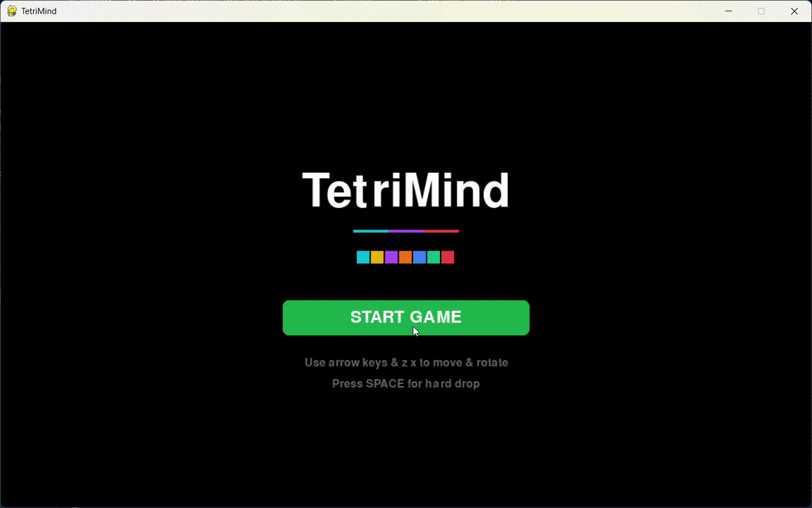
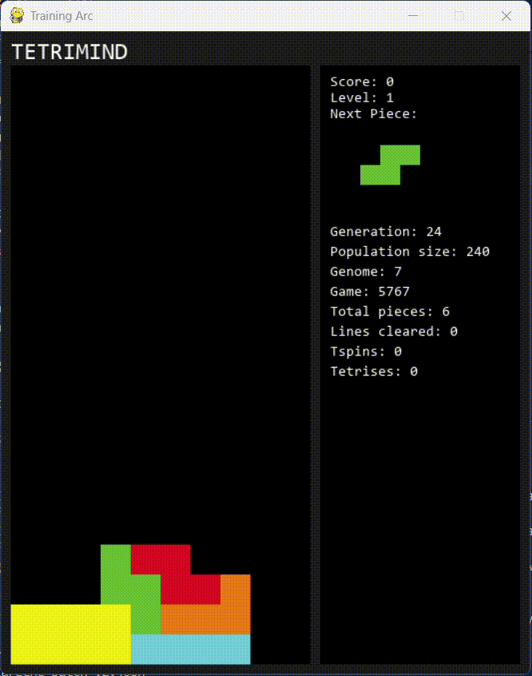
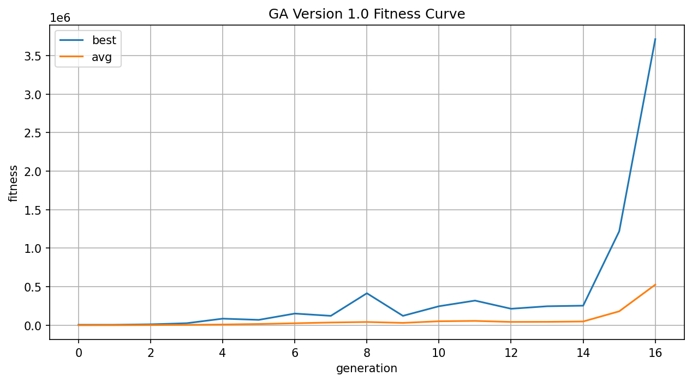
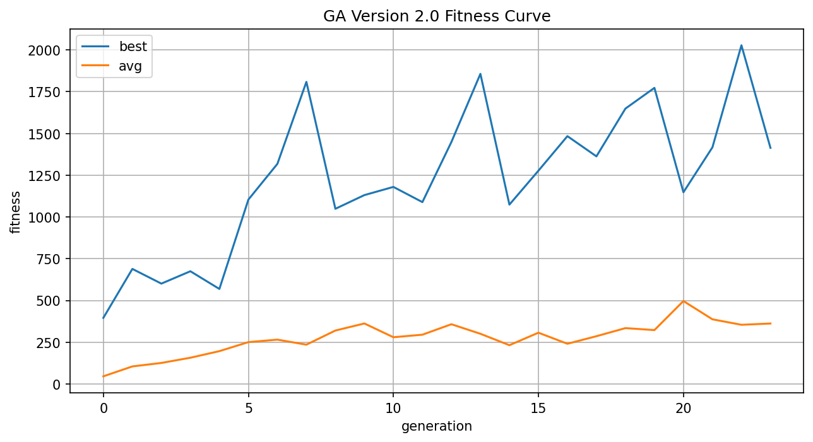

# TetriMind
A Tetris Game with Reinforcement Learning AI Agent

## Game Demo

## Training Demo

## Setup
- Clone the repository and install dependencies from `requirements.txt`

      pip install -r requirements.txt

- Open the folder in Visual Studio Code and run:

      python3 project/main.py

 

## Features
- Classic Tetris with responsive controls
- Player vs AI mode with difficulty levels
- Realistic AI moves
- Versus AI garbage lines
- T-spins
- Retrainable Tetris Agent (Genetic Algorithm)

# Results
## Genetic Algorithm
- Mutation rate: 0.05
- Mutation step: 0.2
- Reward/Fitness: pieces survived + lines cleared
- Feature function: holes, bumpiness, weighted height, cumulative height, relative height, vertical hole tunnels, max well depth, sum wells, weighted filled cells, landing height, hole depth, row hole

## GA Version 1.0
- Generations: 17
- Population: 60
- Games: 1,020 gameovers
- Standard 7-Bag w/ changing seeds per generation

## GA Version 2.0
- Generations: 24
- Population: 240 (4x bigger sample)
- Games: 5,760 gameovers
- 11-Bag: 7Bag but 3x more S & Z hard mode pieces
- Changing seeds

## Tech Stack
Language: Python
 Main Library: pygame
 Optional Library: pyinstaller (exe bundling), matplotlib (training)

# Useful Links:
- [Reinforcement Learning on Tetris](https://rex-l.medium.com/reinforcement-learning-on-tetris-707f75716c37)
- [Evolving Tetris AI based on genetic algorithms](https://github.com/mzmousa/tetris-ai?tab=readme-ov-file)
